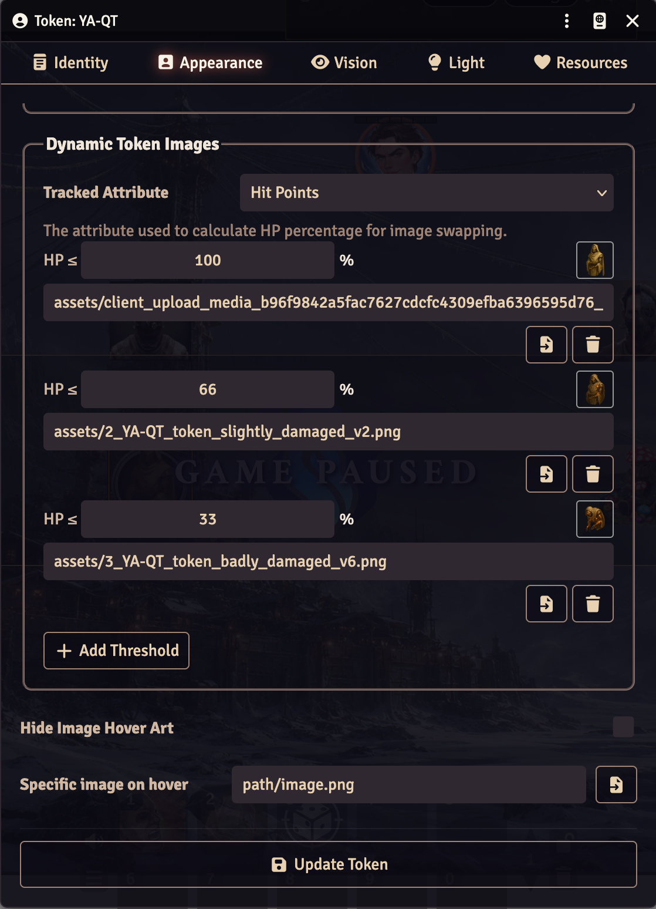

# Dynamic Tokens

A [Foundry VTT](https://foundryvtt.com/) module that automatically swaps a token's
image as its HP changes. Define HP-percentage thresholds per token and Dynamic
Tokens picks the matching image whenever the actor takes damage or heals — no
macros, no per-system setup.

It is **system-agnostic**: you choose which attribute represents HP, so it works
in dnd5e, Pathfinder, Daggerheart, and homebrew systems alike.

## Screenshot



## Features

- 🩸 **Threshold-based image swapping** — e.g. show a bloodied portrait at ≤ 50% HP
  and a "downed" image at ≤ 0%.
- 🎛️ **Per-token configuration** in the Token Config *Appearance* tab — no global settings to wrangle.
- 🧩 **System-agnostic** — the attribute dropdown is populated from the same list
  Foundry uses for token resource bars, so any numeric `value`/`max` attribute works.
- 🔁 **Reversed-resource support** — handles systems where the tracked value counts
  *damage taken* instead of remaining HP (e.g. Daggerheart).
- 🖼️ **Applies on scene load and token placement**, not just on live HP changes.

## Installation

1. In Foundry, go to **Add-on Modules → Install Module**.
2. Paste the manifest URL:
   ```
   https://github.com/aronjanosch/dynamic-tokens/releases/latest/download/module.json
   ```
3. Enable **Dynamic Tokens** in your world's module settings.

## Usage

1. Open a token's configuration (right-click a token → ⚙️, or edit the actor's
   **Prototype Token**).
2. Go to the **Appearance** tab and find the **Dynamic Token Images** section.
3. Pick the **Tracked Attribute** that represents HP (e.g. `resources.hitPoints`,
   `attributes.hp`).
4. Click **Add Threshold**. For each row, set:
   - **HP ≤** — the percentage at or below which the image applies.
   - **Image** — type a path or use the file picker.
5. That's it. The image swaps automatically as HP changes.

### How thresholds are matched

Thresholds are evaluated from **lowest percentage upward**, and the first one the
current HP% falls at or below wins. Example:

| HP ≤ | Image            |
|------|------------------|
| 0    | `downed.png`     |
| 50   | `bloodied.png`   |
| 100  | `healthy.png`    |

- At 75% HP → `healthy.png` (first match is the 100 row).
- At 40% HP → `bloodied.png`.
- At 0% HP → `downed.png`.

> **Tip:** add a `100` threshold for the full-health image so the token reverts
> when the actor heals back up. Without a matching threshold the image is left
> unchanged.

### Reversed resources

Some systems track *damage taken* rather than remaining HP (value `0` = full,
value = max = dead). If the attribute exposes an `isReversed` / `reversed` flag,
the percentage is inverted automatically so thresholds still mean "remaining HP".

## Compatibility

- **Foundry VTT v13** (verified). Uses the v13 ApplicationV2 Token Config and the
  forward-compatible `FilePicker` namespace.

## How it works

Configuration is stored in token-document flags (`flags.dynamic-tokens`), so it
travels with the token and never touches actor data. Image swaps are driven by:

- `updateActor` — reacts to live HP changes (only on the acting client).
- `createToken` — syncs a newly placed token to current HP.
- `canvasReady` — the active GM syncs all tokens when a scene loads.

## Development

```
dynamic-tokens/
├── module.json                       # Manifest
├── scripts/dynamic-tokens.js         # Hooks + image-swap logic
├── templates/token-config-tab.hbs    # Config UI injected into Appearance tab
├── styles/dynamic-tokens.css         # Layout for the config fieldset
└── lang/en.json                      # Localization strings
```

## License

[MIT](LICENSE)
